# Overview

The following is a step-by-step guide for acquiring phone numbers using Phone System in Office 365.

If your company already uses Microsoft Office, you probably already have an active license to provision phone numbers.  Contact your Office tenant admin (who creates new Outlook e-mail accounts when new employees join your company) to request new phone numbers using the instructions below.

# Requirements
Before you start the guide, make sure you meet the following requirements
* Ensure you have a valid Phone System and calling plan licenses
  * An Office 365 E3 license + a calling plan 
  * or an Office 365 E5 license.
* You must have admin permissions to perform these steps. This means
   * Either, these steps are performed by a [Microsoft Teams Admin](https://docs.microsoft.com/en-us/office365/admin/add-users/about-admin-roles?redirectSourcePath=%252fen-us%252farticle%252fda585eea-f576-4f55-a1e0-87090b6aaa9d&view=o365-worldwide) for your organization.
   *  Alternatively, you can yourself [buy](https://aka.ms/ivr1) a new Office 365 License specifically for your bots. 
      * You can start a with a free trial and request a free extension of your free trial from us during testing and development of your IVR

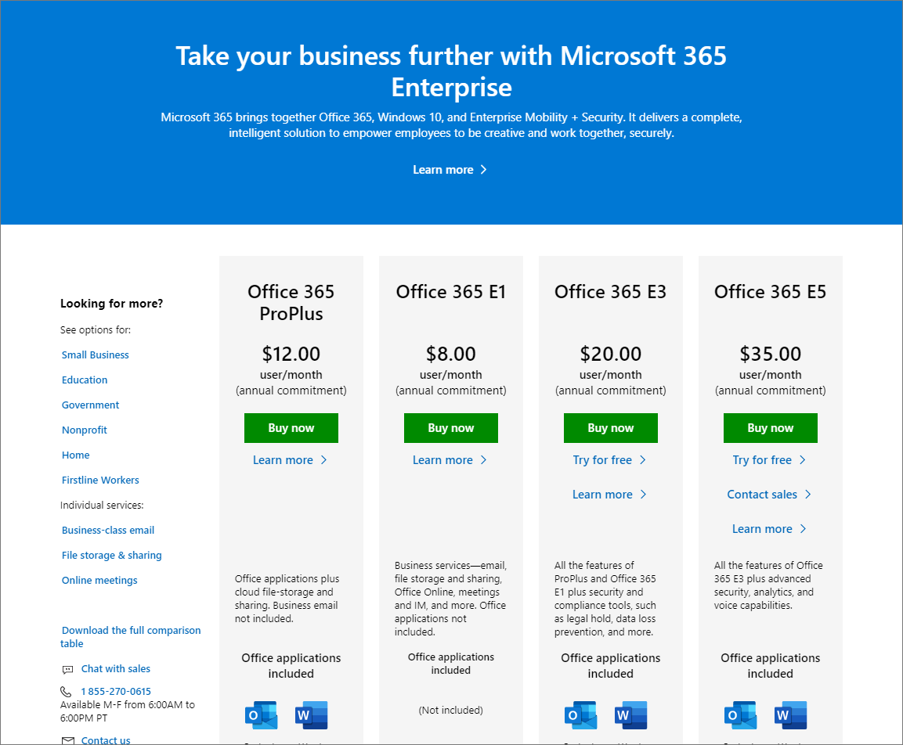


Please note:

1. If you are having an issue at this step getting to this portal, try using incognito window to log into 
[Office Admin Center](https://www.office.com/?auth=2&login_hint={0}&from=AdminCenterEmail)
2. make sure you are logging in with Office 365 license admin credentials for your company - or the trial account credentials you create above!

# Steps

Overall setup can be broken down into following stages:
* [Acquire a phone number](#Acquire-a-phone-number)
* [Create a resource account](#Create-a-resource-account)
* [Assign license](#Assign-license)
* [Bind the phone number](#Bind-the-phone-number)

## Acquire a phone number

Office 365 supports two types of phone numbers:  individual phone numbers, which are best for individual employees and support a limited number of concurrent calls, and service phone numbers that support many concurrent calls.  The second type, service phone numbers, are ideal for resource accounts - for example, conference rooms. 

We will use the second option (a service phone number allocated to a resource account) for our bot, so that it can support many concurrent calls at the same time.

Acquiring a phone number would require performing the following tasks in the following order:

### Step 1 - Go to [Skype for Business admin center](https://aka.ms/ivr2) > Voice
Note that you will need the using the administrator credentials and click "Add" to create a new phone number.


### Step 2 - Select New service numbers option:
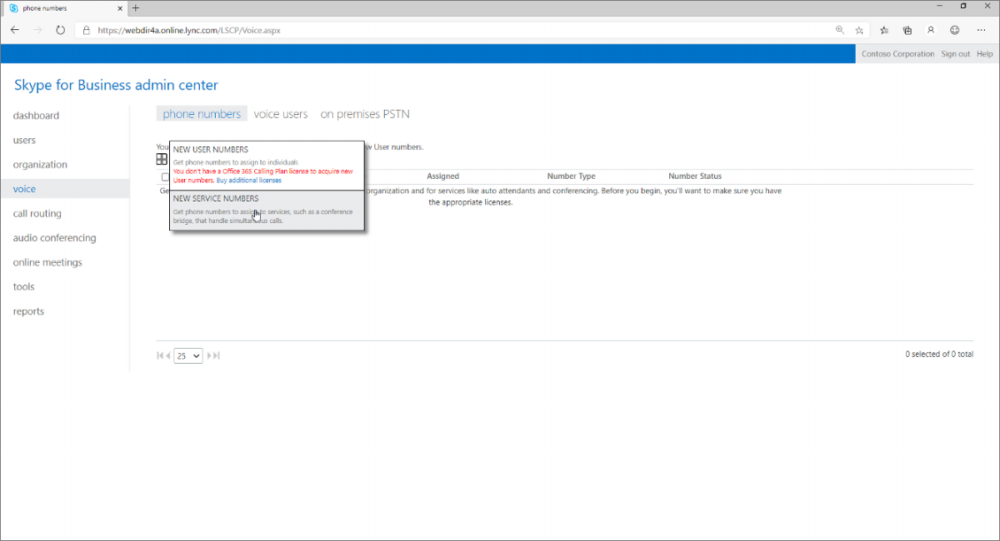

### Step 3 - Select Country
In the next page that follows, select a country for your phone number.

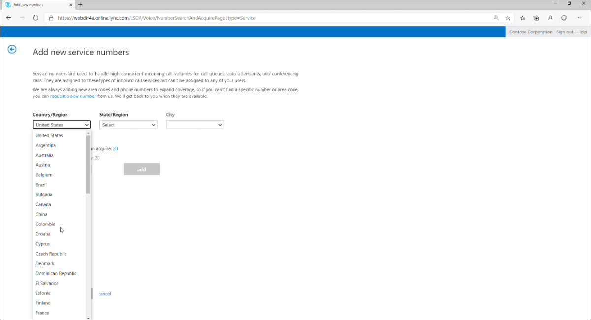

NOTE: Due to varying laws, not all countries are available in this dropdown. If your target country is not in the dropdown, you will need to follow instructions [here](https://docs.microsoft.com/en-us/microsoftteams/manage-phone-numbers-for-your-organization/manage-phone-numbers-for-your-organization?toc=/skypeforbusiness/toc.json&bc=/skypeforbusiness/breadcrumb/toc.json) and provide the "911" emergency local address required by local authorities for calls originating from that phone number.

For IVR private preview customers, if you are unable to get phone numbers (for whatever reason) in the admin portal, you can also reach out to the number management team at gcstnmsd@microsoft.com. That team will work with you to provide the numbers you require.

### Step 4 - Select State/region
Once you select a country, you can select a Toll-Free or a local phone number:

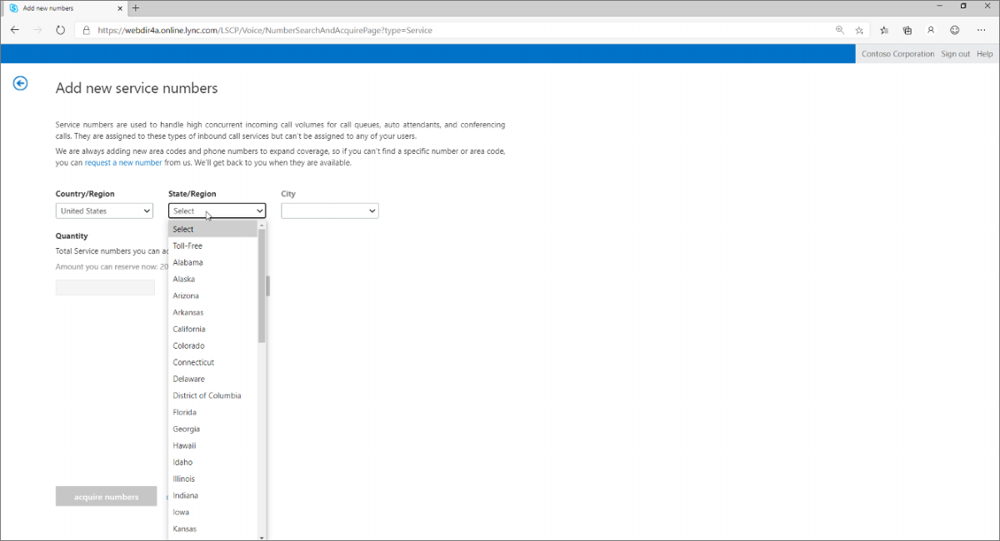

### Step 5 - Select City
Select city to obtain a specific area code:

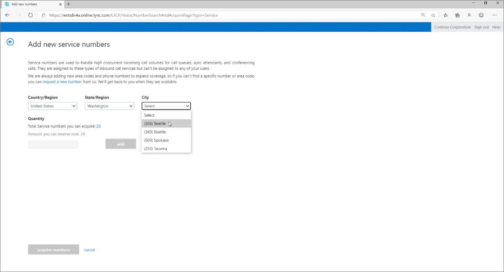

### Step 6 - Select the number of phone lines
If you will have several bots in your IVR as skills (you can develop each skill separately and transfer calls between those), you can obtain more than one phone number -  You can also use one phone number for pre-production, and one for production loads

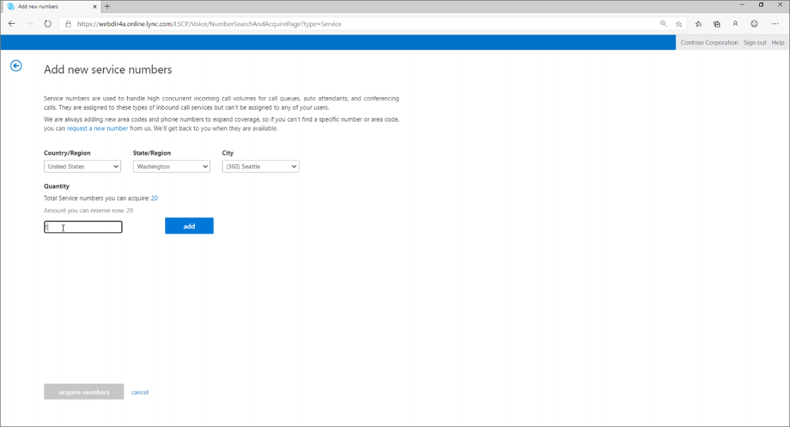


### Step 7 - Acquire number(s)
The system will query available regional inventory of phone numbers and offer you several options.  You can uncheck phone numbers you do not want, and press Acquire Numbers for those numbers that you like:


## Success!!
You should now be able to see your phone number in your account.  This phone number is now assigned to you.  You can either use built-in voicemail capabilities, or bind it to your bot to create an intelligent IVR using the steps in Section 2.

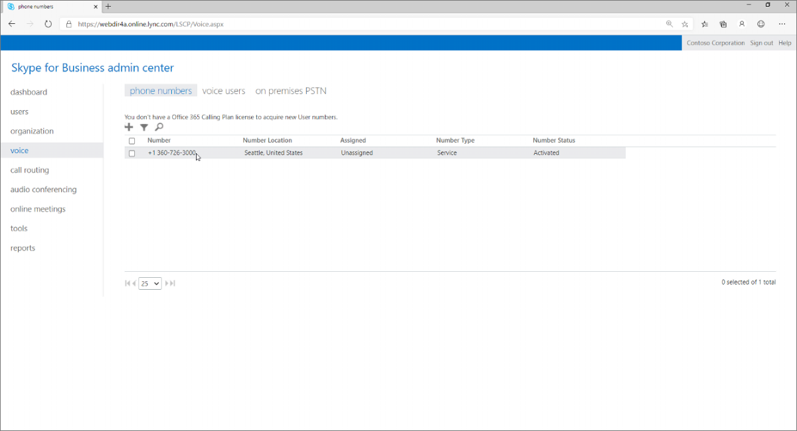

You can also use this UI to do the same: https://admin.teams.microsoft.com/phone-numbers
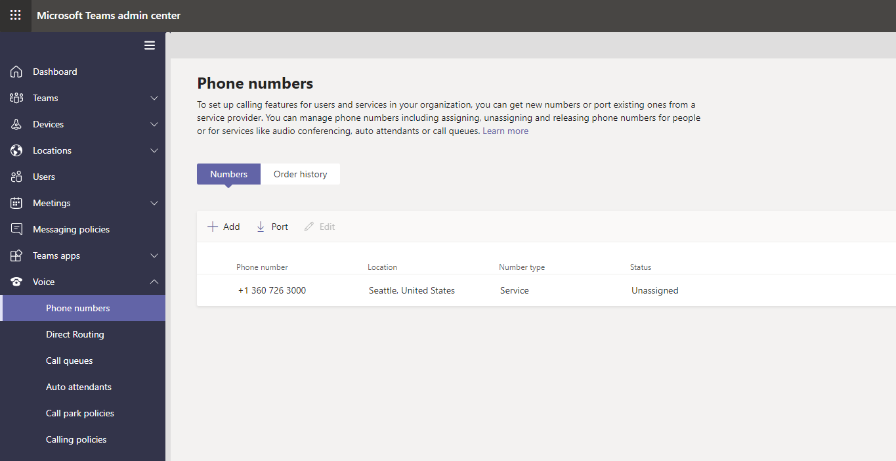

## Create a resource account
Now since have a phone number. Next, you need to create an identity that can "pick up" the calls (ie, identify who the calls will be redirected to when they come in), and assign that entity an Office 365 license.

Acquiring a phone number would require performing the following tasks in the following order:

### Step 1 - Authenticate to [Microsoft Teams admin center](https://aka.ms/ivr3)

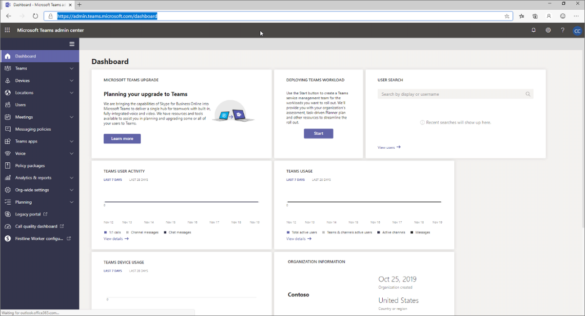

### Step 2 - Go to [Resource Account portal](https://aka.ms/ivr3) 
Click on Add to add a new resource account.  Creating a resource accounts is just like adding a new user to your company - just non-human (a conference rooms, a bot, a toll-free 1-800-Contoso line, etc).

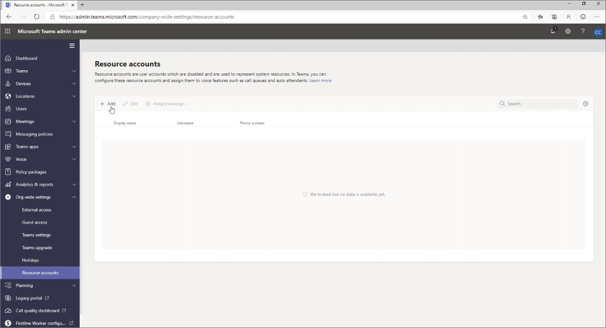

### Step 3 - Add a new Resource Account 
Fill out the Display name of your bot, give it a username, and set the Resource Account Type = Auto Attendant.  Click Save at the bottom.
  * Note down the chosen resource name and domain name. This will be needed later in the [Binding stage](#Bind-the-phone-number)

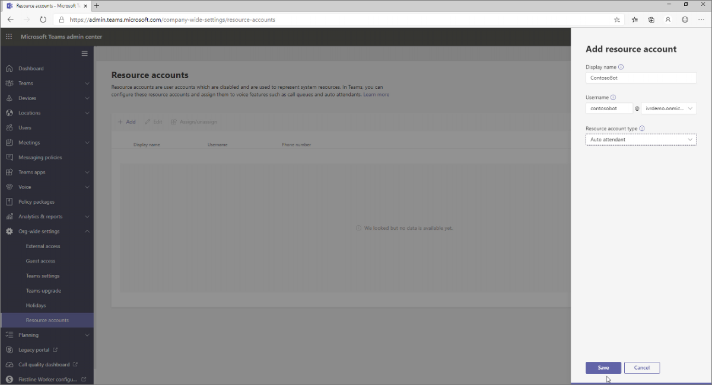

## Success!
You now have a phone number, and the calls coming into this phone number can be routed to some entity - in this case, a resource account, identified by a login.   Next, we will assign one of your licenses to this account for the line to become active and have a dialtone.
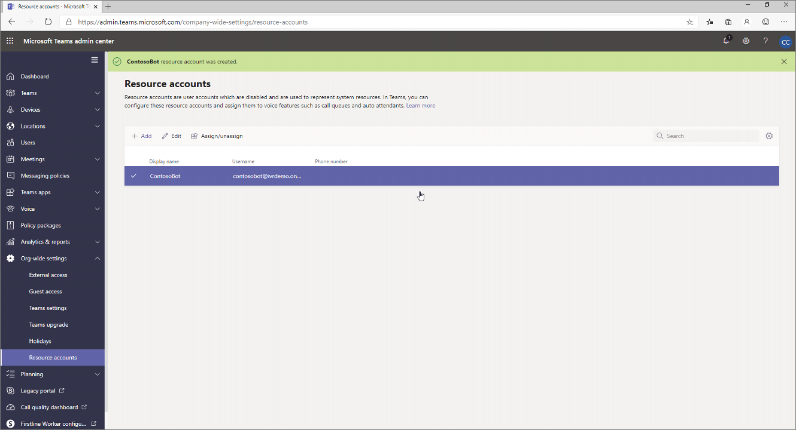

## Assign license
If you are using an Office 365 E5 trial, your account comes with a pack of 25 licenses - ie, 25 live phone numbers anywhere in the world -  If you have a regular Office 365 account, you can use those licenses to license this resource account.   Let's license the resource account to enable the resource account to act on this phone number.

Assigning license to a resource account  would require performing the following tasks in the following order:

### Step 1 - Go to [Users ](https://aka.ms/ivr4)
The resource account you created should appear on the list.  Note that at the moment, Licenses column states "Unlicensed".  Let's activate this account so that it can pick up the phone by assigning an active license to it.  Click on the account name:

### Step 2 - Activate License

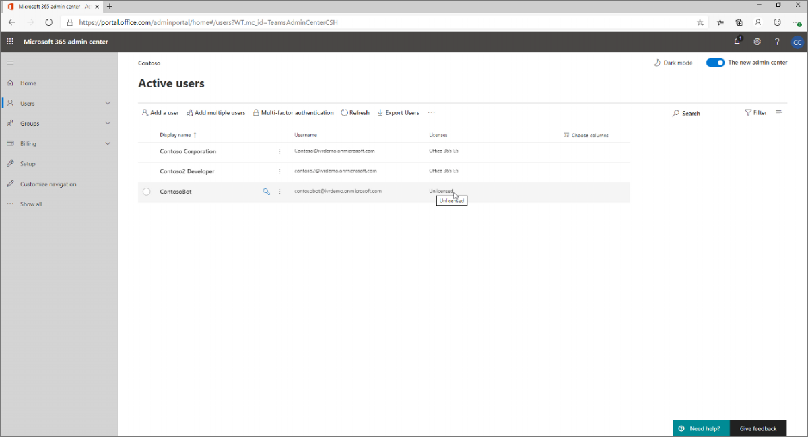

On the slide-out that opened, click on **Licenses and Apps**:

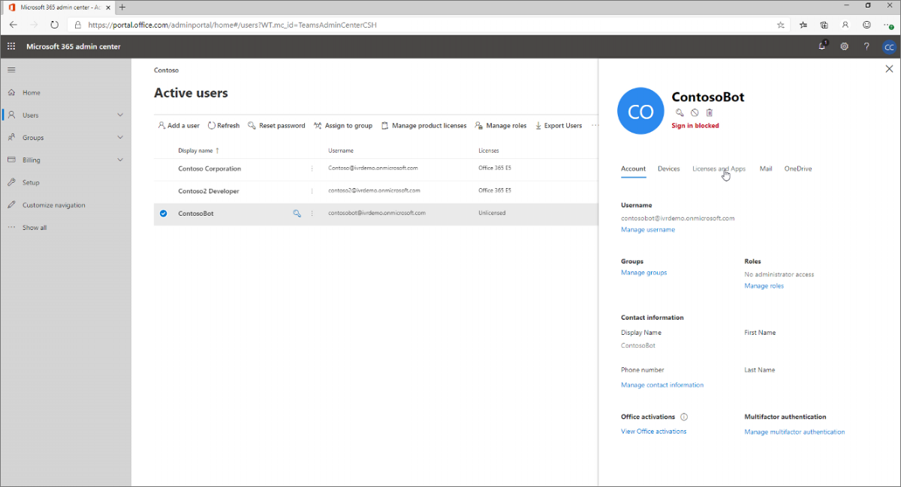

### Step 3 - Select License
Check an **Office 365 E5 license** - this license includes phone lines.
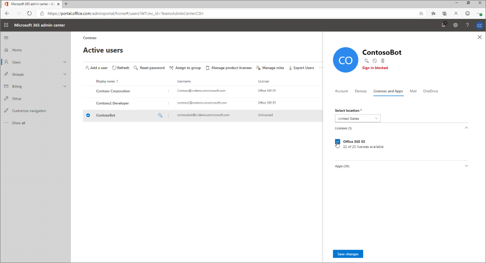

## Success!
You have created a phone number, provisioned an identity for a future bot that will be answering phone lines, and activated a phone line by assigning a license to it.  This is very similar to how you provision phone numbers with other telephony providers like Twilio. The phone line is now in service - you should be able to dial it, although there is no bot yet there to talk to you, so the phone will just keep ringing.

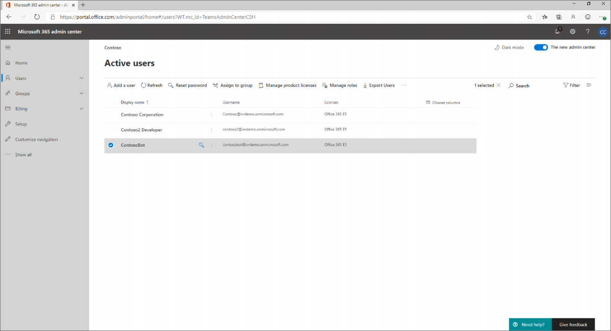

## Bind the phone number
This is the last and most important part of the Phone number aquistion process where you would need to bind the acquired phone number backed with a resource account with assigned license. 

Here are the steps needed to complete the Phone number acquistion process
1. Download and install the [Skype for Business Online Connector module](https://www.microsoft.com/download/details.aspx?id=39366), and then restart your computer if prompted.

2. Connect using a Skype for Business Online administrator account with multifactor authentication
   *  Open a Windows PowerShell command prompt and run the following commands:
   ```
      Import-Module SkypeOnlineConnector
      $sfbSession = New-CsOnlineSession
      Import-PSSession $sfbSession
   ```
   * When prompted by the New-CsOnlineSession command, enter your Skype for Business Online administrator account name.
   * In the Sign in to your account dialog box, type your Skype for Business Online administrator password, and then click Sign in.
   * Follow the instructions in the Sign in to your account dialog box to provide additional authentication information, such as a verification code, and then click Verify.

3. Run the following command to complete the binding
   ```
      # Replace
      #  resourceusername with user name chosen during Create a resource account > Add a new Resource Account
      #  domainname with the domain name for the Office 365 account. 
      # e.g. "telephonyuser123@contoso.onmicrosoft.com"

      $appInstance = Set-CsOnlineApplicationInstance `
          -Identity resourceusername@domainname.onmicrosoft.com `
          -ApplicationId daca305a-db90-4689-acff-90df749b5c78

      Sync-CsOnlineApplicationInstance -ObjectId $appInstance.ObjectId

   ```


In the next step, we will create a bot in Azure that will interact with users.
