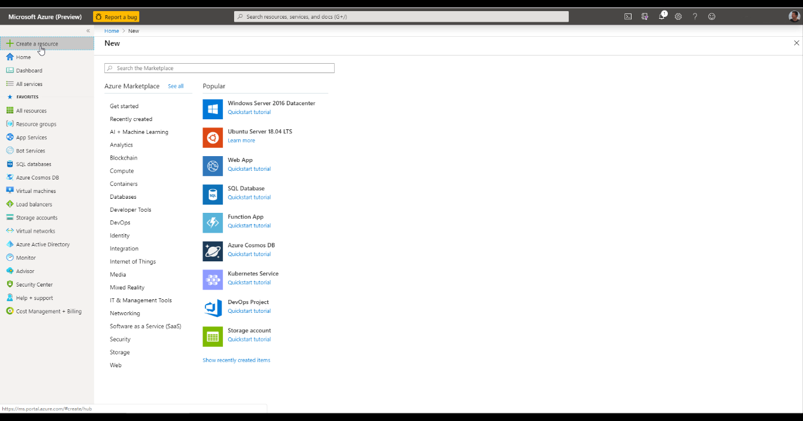
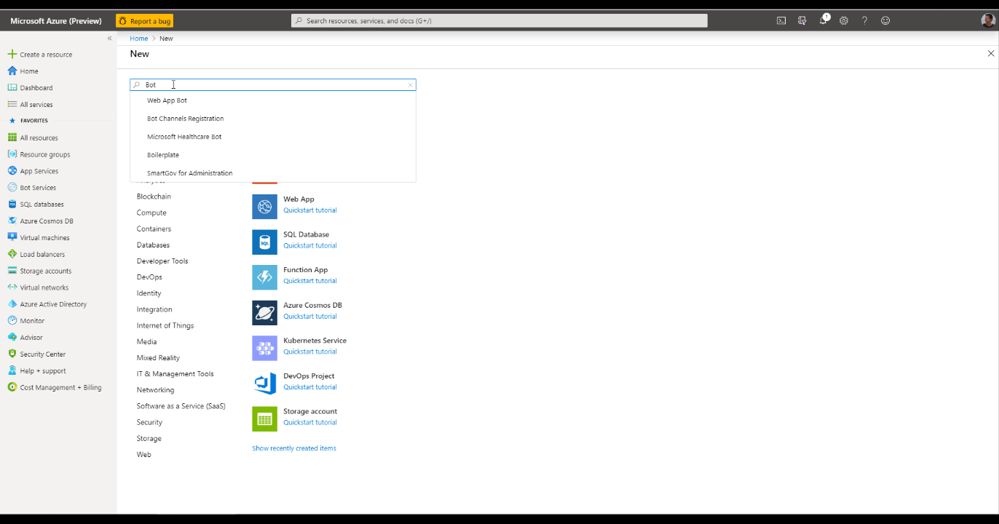
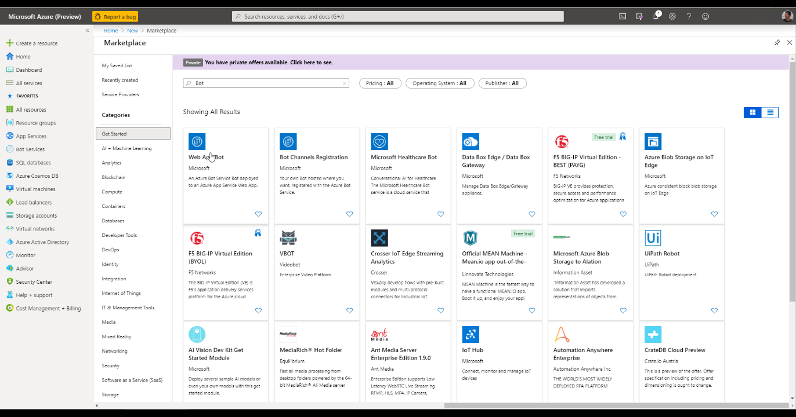
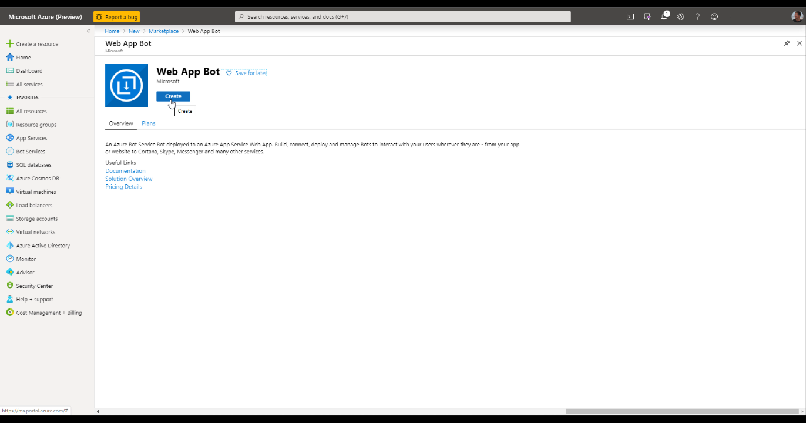
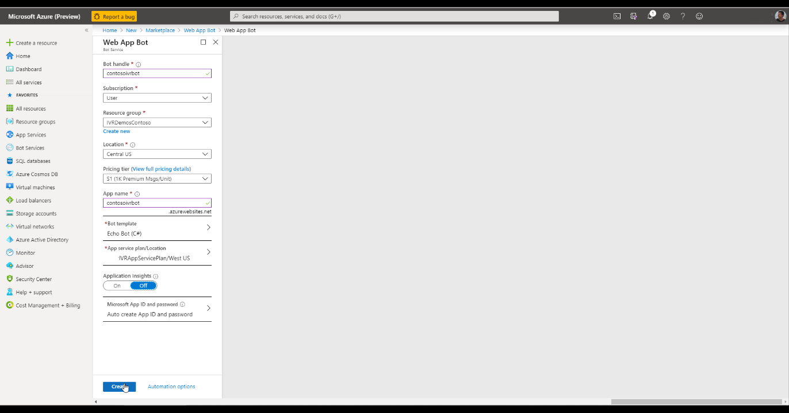
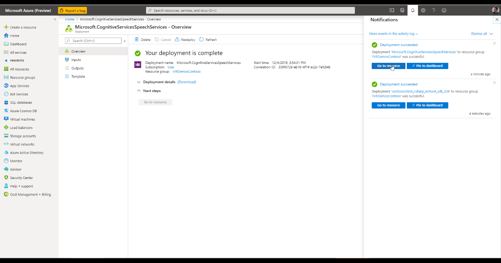
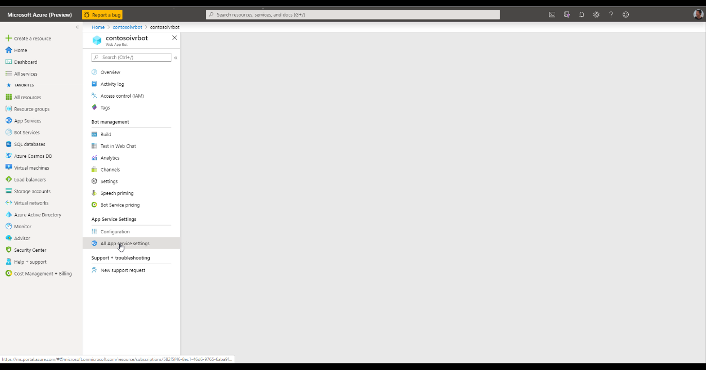
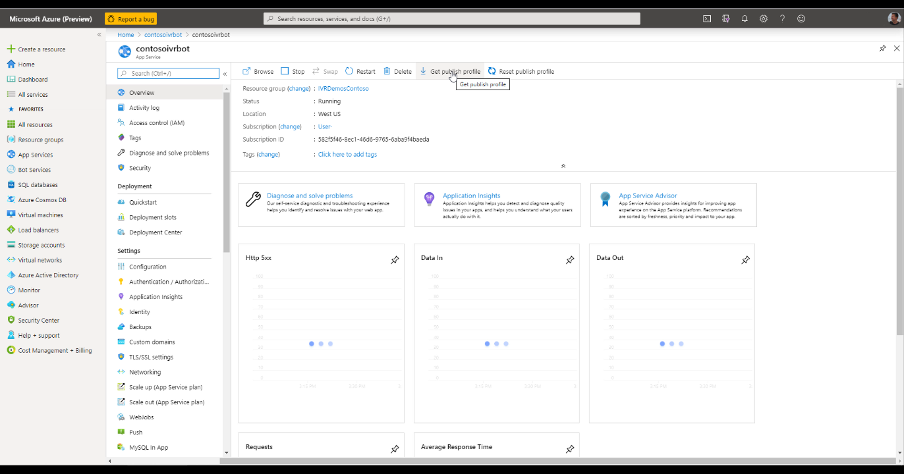
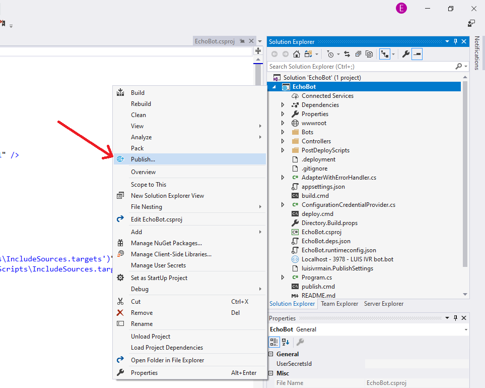
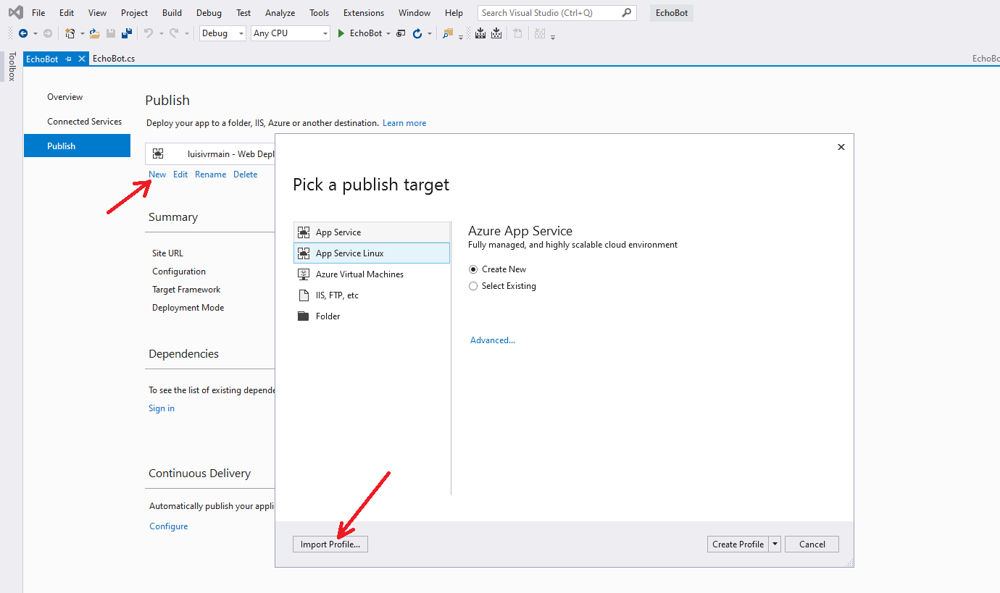

# Create a Bot in Azure Bot Framework

In this step, we will create a new bot in Azure that we could then link to the phone number we created in the previous steps.

NOTE: if you run into any issues in this step, see [Troubleshooting](TroubleshootingTelephonyBot.md) steps. Also, consult that page regarding how to adjust your bot's source code for it to work seamlessly with Telephony.

Log into Azure with your Azure admin credentials - or create a new free trial account of Azure. 
Open https://aka.ms/ivr6 to go directly into the bot flow creation if you are an expert user.  Otherwise, after you log into Azure, click **Create a resource**:

Type in "Bot" and press **Enter**:

Among the options, click on **Web App Bot**.  This is the main Microsoft Bot Framework offering:

Click **Create**:

Fill out the settings for your bot.  For reduced latency for telephony, for **Location** we recommend one of these regions:  West US, West US 2, East US, East US 2, West Europe, North Europe, Southeast Asia.  You may start with **F0** free plan, but for production loads, you should use **S0** plan that does not have monthly limits:

At the bottom of the screen, click **Create**.  

Azure is now going to start the deployment of your bot resources.  This usually takes a minute or two.  

After your bot is created, navigate to that bot:

On the left side, click on **All App service settings**:

At the top, click **Get publishing profile**.  You can use the publishing settings provided in the downloaded file to deploy your bot's code from Visual Studio easily with just two clicks: 

The file that is downloaded is what you will use to publish the source code of your bot back into the Web App after you are done developing and testing your bot locally on your machine.  This file contains authentication credentials for publishing into your bot, so do not add this file to source control to avoid accidentally exposing these keys.

At this point, you can [clone the Telephony bot sample](samples/csharp_dotnetcore/01.telephony-echo) or develop your bot using the [Bot Framework SDK](https://github.com/microsoft/botframework-sdk) as you normally would. 

After you complete the rest of the pages in this tutorial and [Enable your bot to speak and understand voice](CreateSpeechResource.md), right click your Project (not Solution) in Visual Studio, and click Publish.

You can then click **New**. In the dialog that opens, click **Import profile...**.  

In the window that opens, select the Publishing profile you downloaded in the steps above and press **Publish**.  That will deploy your bot's source code into the Web App that you created above. 

**Next step**:  [Enable your bot to speak and understand voice](CreateSpeechResource.md)
