You should use your company's Office 365 tenant to create the production IVR.  This is a preferred method. 

However, during proof of concept/exploration phase, you may choose to start in a temporary test account, using a free trial in Office 365.  Below are the steps to create a free temporary trial.  If you are happy with your IVR, you can then convert this account to a paid account.

NOTE: If you are a part of Private Preview program, feel free to reach out to your Microsoft Bot Framework contact to request a trial to be extended to the needed development and testing timeline.

First, start by opening a new InPrivate window in your browser to avoid being signed in to existing Microsoft services. Go to https://aka.ms/ivr1:

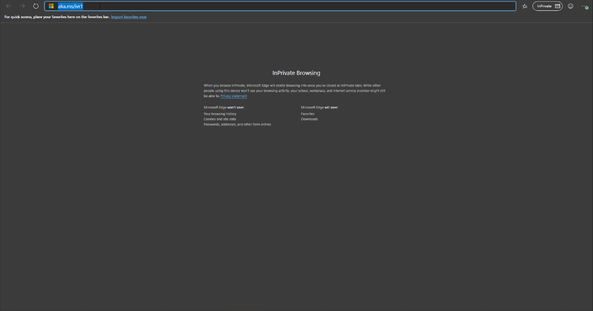

In the window that opens, you need to select the "E5" plan (right-most column). Under the "Buy now" button, click on **Try for free**.

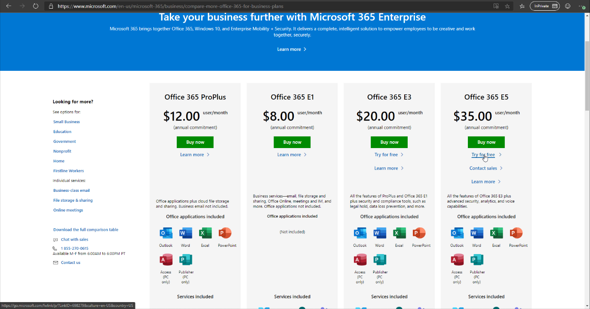

You need to register for the trial. Provide your e-mail address where you want to receive the confirmation, and click **Next**:

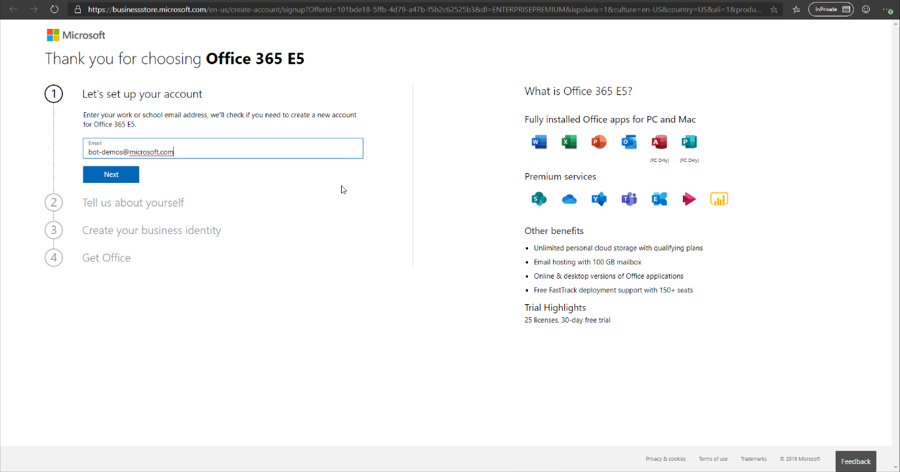

If you use an e-mail address that does not already have an account, you can click **Create new account**:

Fill out your name and contact information.  Click **Next**:

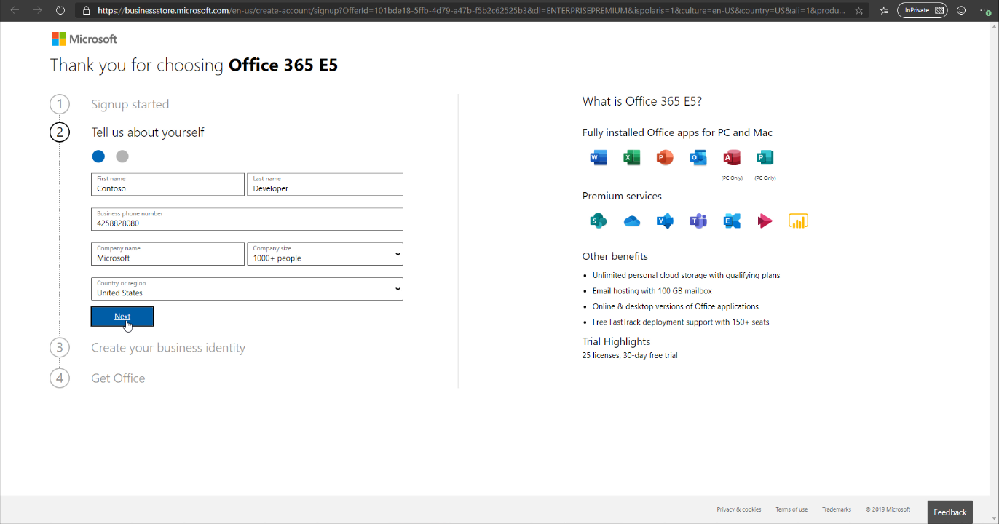

Verify you are not a robot by getting a text message or a call.  Press **Send verification code**:

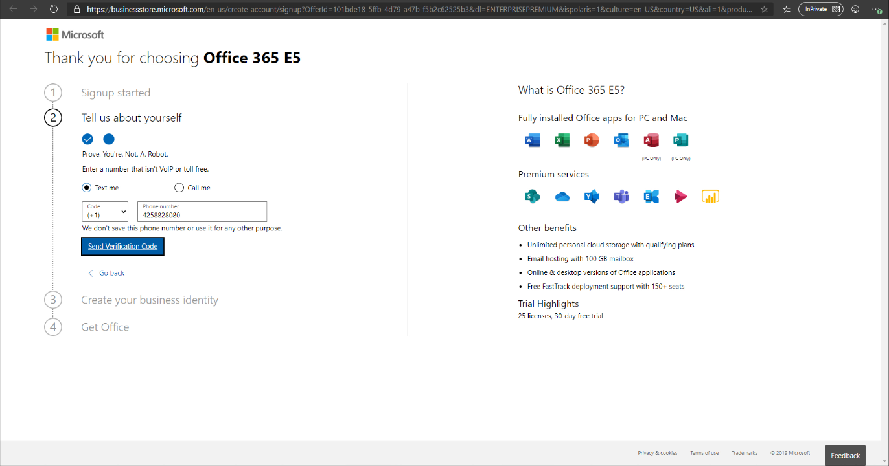

Next, this is where you will create your Tenant. All user logins you will use in this tenant will end up looking like user@TENANT.onmicrosoft.com in this trial.  You will be able to use a custom domain later.  Press **Check availability**:

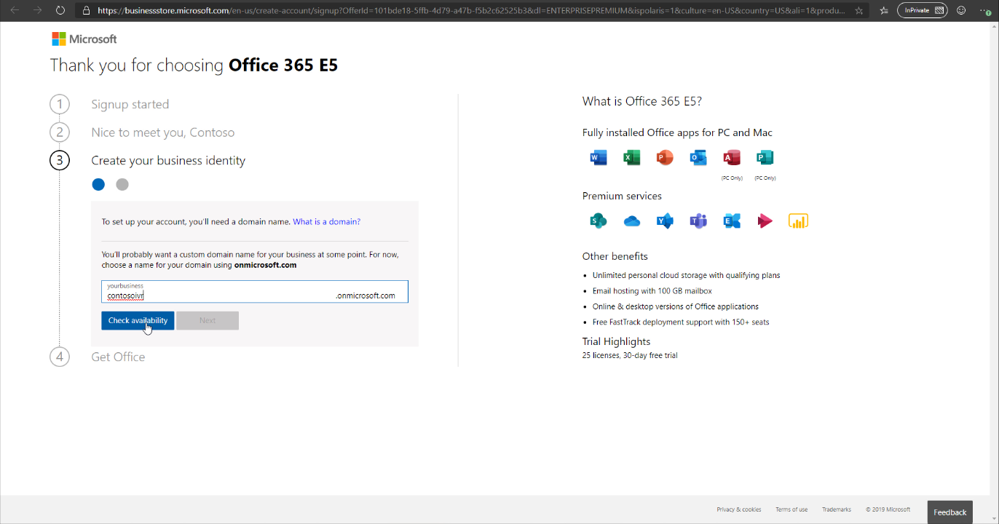

If the tenant name is available, you can click **Next** to use it:

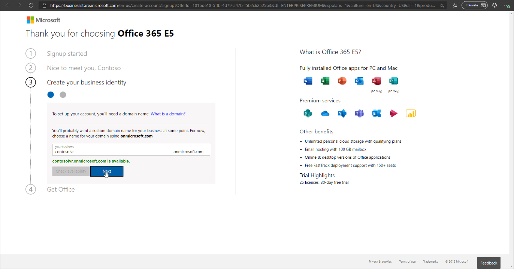

Now, create a username and password. Click **Sign up**:

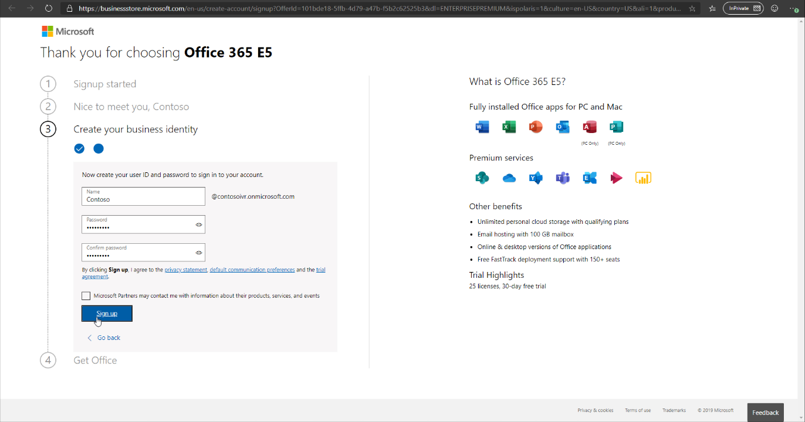

If everything went successfully, your account is now created. Write down the sign-in page for future use and note the user ID.  Now is the time to set up your new account.  Click **Go to setup**:

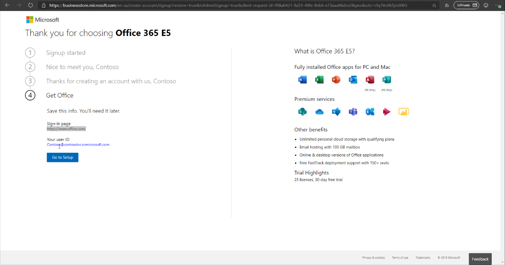

This is the account set up phase.  Since it is a trial account, you can select option 2 to use the existing tenant name that you selected previously.  Select option 2 and press **Next**:

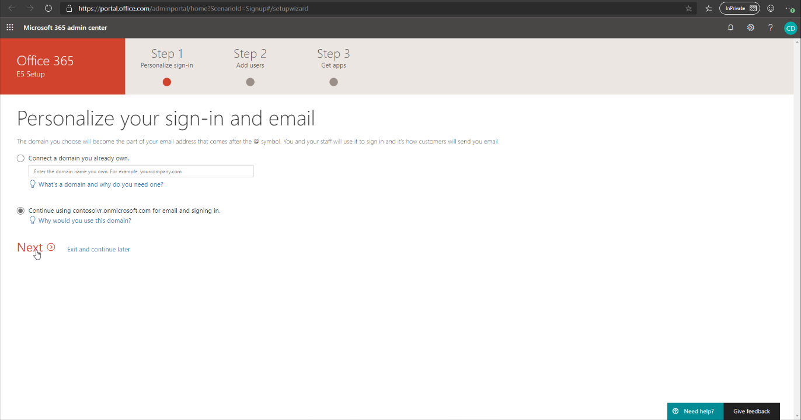

If you have additional tenant admins (for example, colleagues who may be working on the IVR with you), you can add them here.  Do not add too many, as you'd want to use some of the allowed 25 lines for your future bot / IVR:

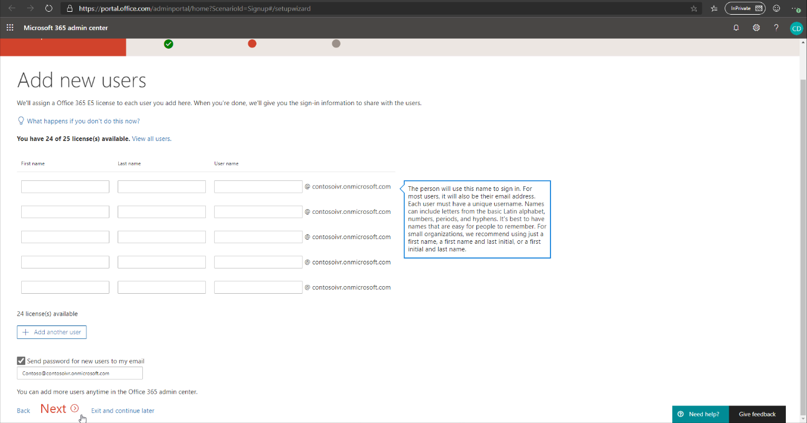

Skip creating teams - click **Next**: 

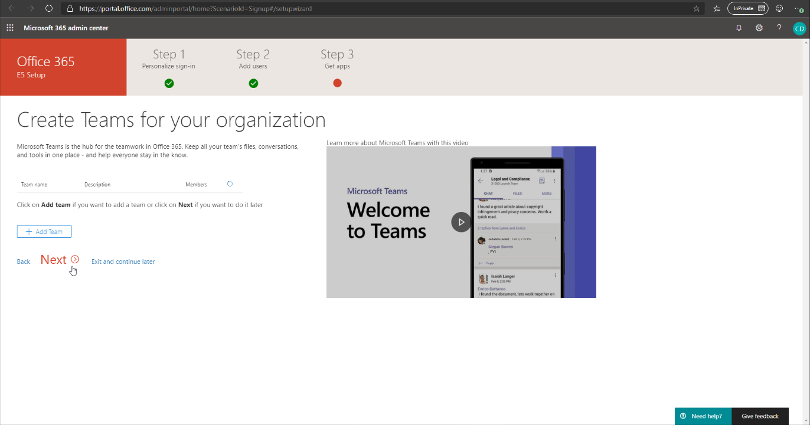

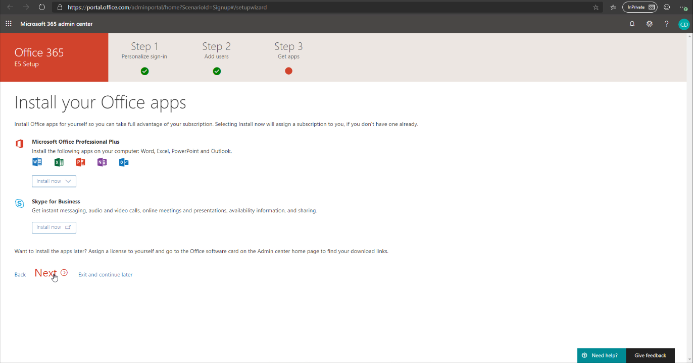
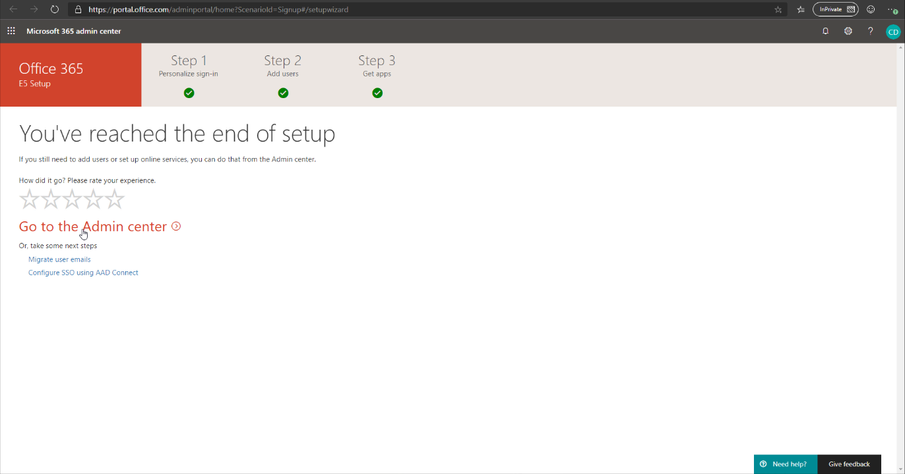
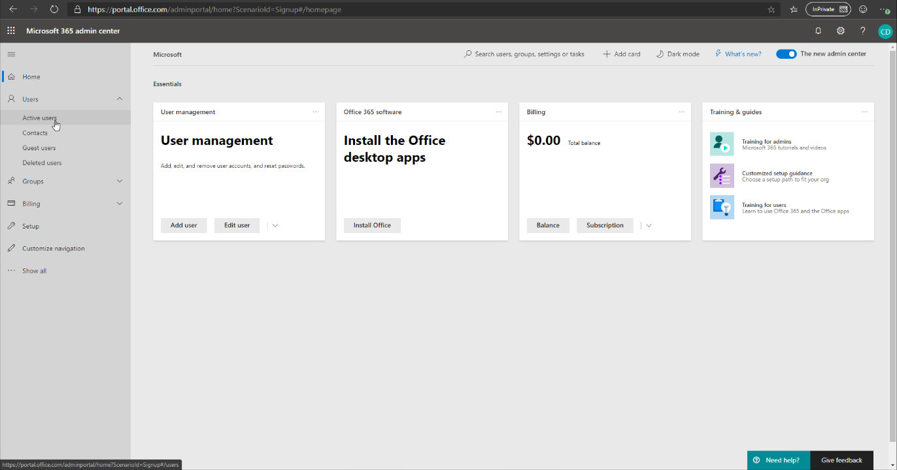
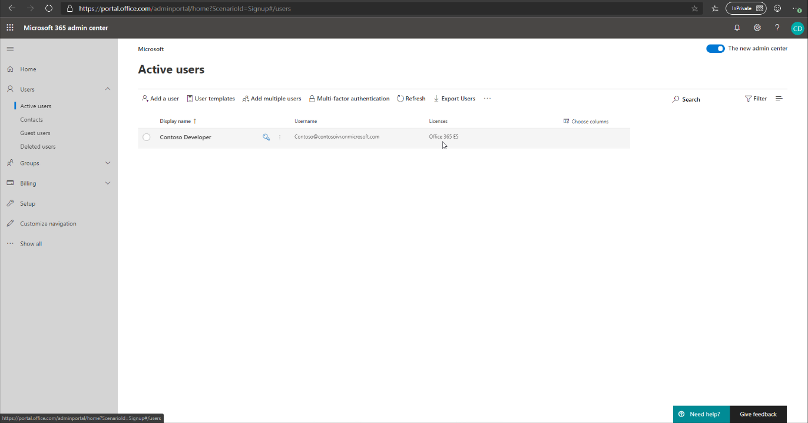
