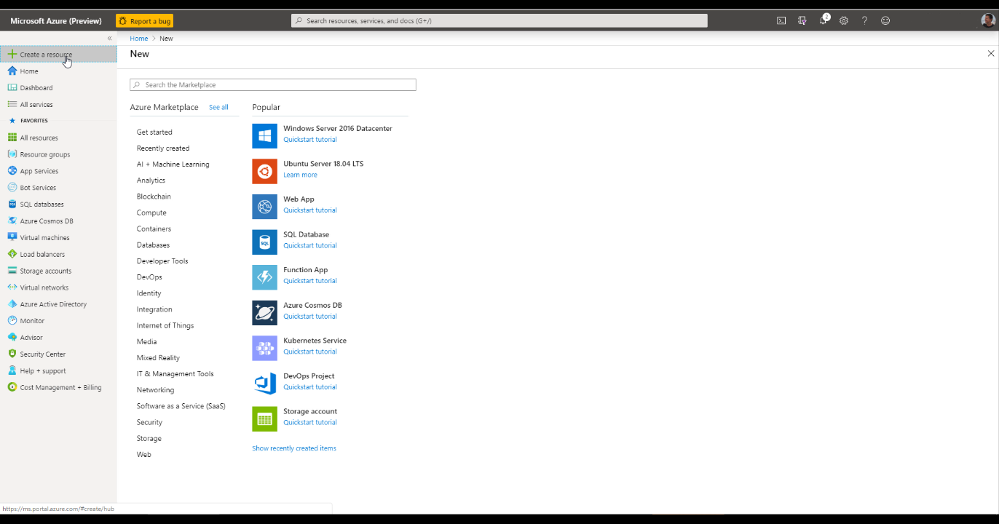
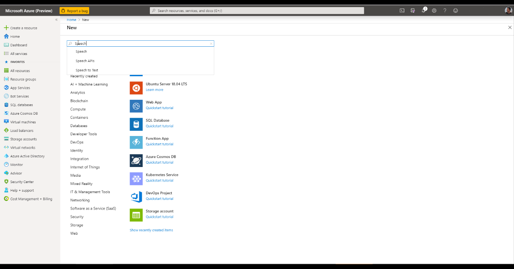
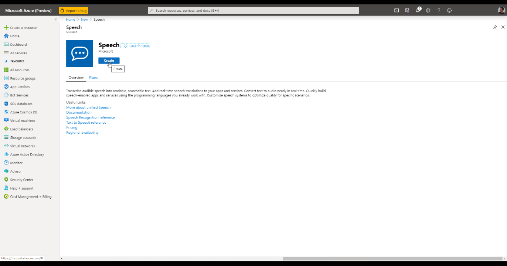
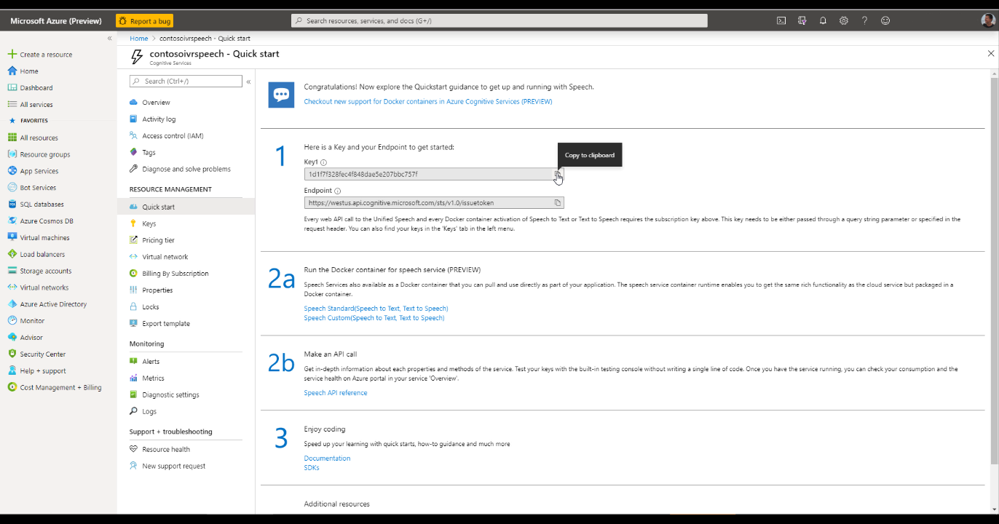
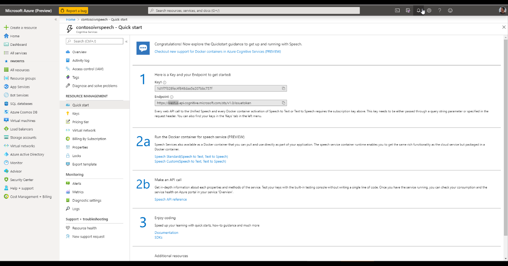
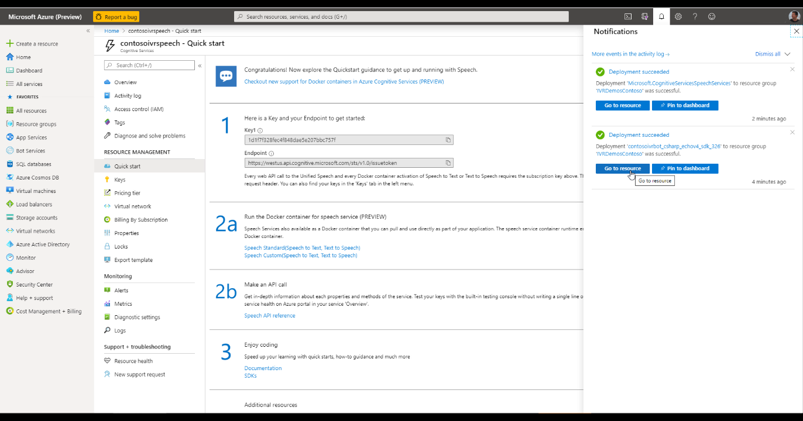

# Create a Speech Services resource

Now that you have the bot, we need to give it ability to speak (text-to-speech) and understand human voice (speech-to-text). To do that, we will create a Speech resource in Azure:

Go to the [Azure portal](https://portal.azure.com) and select **Create a resource** from the left navigation:

In the search bar, type "Speech" and press **Enter**:

Click **Create**:

You'll be prompted to provide some information:
   * Give your resource a **Name** (fpr example, **TelephonyChannelSpeech**)
   * For **Subscription**, choose the appropriate subscription
   * For **Location**, choose the appropriate region.
   
Ideally, this should be same as Bot's Azure region for best latencies. Please note that currently Telephony Channel is only supported in following Azure regions:
        * West US
        * West US 2
        * East US
        * East US 2
        * West Europe
        * North Europe
        * Southeast Asia
   * For **Pricing tier**, select **F0** (Free Tier) to start with. Note that usage in Free tier is subjected to [Free tier Limits](https://azure.microsoft.com/en-us/pricing/details/cognitive-services/speech-services/)
   * For **Resource group**, select an existing resource group or create a new resource group.
After you've entered all required information, click **Create**. 

It may take a few minutes to create your resource. After the deployment is complete, navigate to the Speech resource you created:

Note down **Cognitive Service Subscription Key** for this resource. You can access these keys at any time from your resource's **Overview** (Manage keys) or **Keys**:

Also note the region part of the endpoint URL:

This is the service that will enable your bot to understand spoken words and speak back to users on the phone using one of the 80+ human voices.  You should now head back to the bot you created earlier:

**Next step**:  [Enable Telephony as one of the channels in your bot](EnableTelephony.md)
