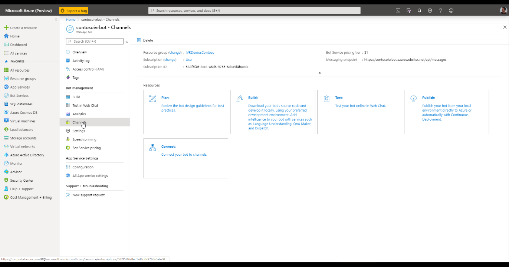
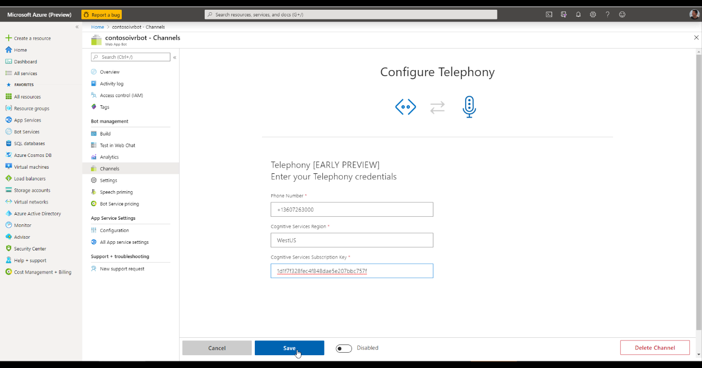

# Telephony Channel
Telephony Channel in Microsoft Bot Framework allows you to bind an existing PSTN phone number acquired using Microsoft Teams Phone System with a Bot in Microsoft Bot Framework.

Telephony channel under the hood is built upon Microsoft Speech Services to allow Speech to Text and Text to Speech capabilities crucial for enabling an audio interaction/conversation over phone lines.

Please follow these steps to enable a Telephony channel for your bot.

## Enable Telephony Channel in the bot

Once we have created a speech resource, we are ready to use it and configure it using the information collected in previous sections.

Go to the [Azure portal](https://portal.azure.com) > Bot (Created in previous [step](CreateBot.md)) > Channels

For you to see Telephony as one of the options, your Azure account needs to be whitelisted for the Private Preview by a member of Microsoft Bot Framework team.  If you were whitelisted successfully, you will see the Telephony channel:

Configure the channel with following information:

* Telephony number - Acquired previously in [Provision a new phone number for your bot in Office 365](AcquirePhoneNumber.md)
    * Please note the format of the phone number (+12345678910) is important
* Cognitive Service Subscription Key - Acquired while [creating the Speech Resource](#Step-1---Create-a-Speech-Services-resource)
* Location for the chosen for the Cognitive Service Speech Resource 
    - Format: WestUS, WestUS2, EastUS, EastUS2, WestEurope, NorthEurupe,SouthEastAsia

Click **Save**.

**Next step**:  [Process speech inside of the bot](ProcessSpeechInBotCode.md)
