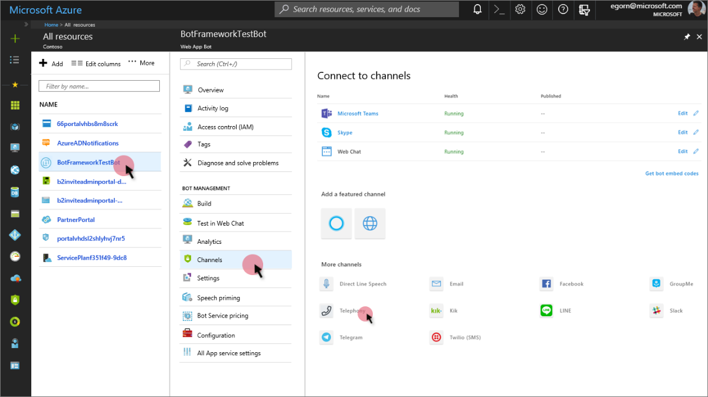
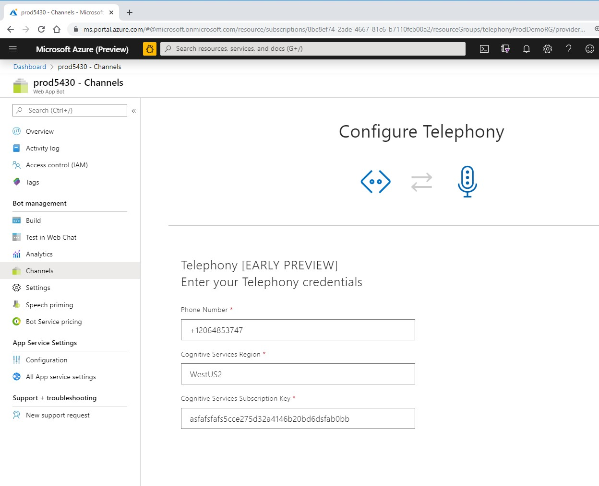

# Telephony Channel
Telephony Channel in Microsoft Bot Framework allows you to bind an existing PSTN phone number acquired using Microsoft Teams Phone System with a Bot in Microsoft Bot Framework.

Telephony channel under the hood is built upon Microsoft Speech Services to allow Speech to Text and Text to Speech capabilities crucial for enabling an audio interaction/conversation over phone lines.

Please follow following steps to enable a Telephony channel for your bot:

## Step 1 - Create a Speech Services resource

Follow these instructions to create a Speech resource:

1. Go to the [Azure portal](https://portal.azure.com) and select **Create a resource** from the left navigation.
2. In the search bar, type **Speech**.
3. Select **Speech**, then click **Create**.
4. You'll be prompted to provide some information:
   * Give your resource a **Name** (Say **TelephonyChannelSpeech**)
   * For **Subscription**, choose the appropriate subscription
   * For **Location**, choose the appropriate region.Ideally, this should be same as Bot's Azure region for best latencies. Please note that currently Telephony Channel is only supported in following Azure regions:
        * West US
        * West US 2
        * East US
        * East US 2
        * West Europe
        * North Europe
        * Southeast Asia
   * For **Pricing tier**, select **F0** (Free Tier) to start with. Note that usage in Free tier is subjected to [Free tier Limits](https://azure.microsoft.com/en-us/pricing/details/cognitive-services/speech-services/)
   * For **Resource group**, select an existing resource group or create a new resource group.
5. After you've entered all required information, click **Create**. It may take a few minutes to create your resource.
6. Once the resource is created, note down **Cognitive Service Subscription Key** for this resource
    * You can access these keys at any time from your resource's **Overview** (Manage keys) or **Keys**.

## Step 2 - Enable Telephony Channel in the bot

Once we have created a speech resource, we are ready to use it and configure it using the information collected in previous sections.

1. Go to the [Azure portal](https://portal.azure.com) > Bot (Created in previous [step](CreateBot.md)) > Channels > Telephony

 

2. Configure the channel with following information
    * Telephony number - Acquired previously in [Provision a new phone number for your bot in Office 365](AcquirePhoneNumber.md)
    * Cognitive Service Subscription Key - Acquired while [creating the Speech Resource](#Step-1---Create-a-Speech-Services-resource)
    * Location for the chosen for the Cognitive Service Speech Resource 
        * Format: WestUS, WestUS2, EastUS, EastUS2, WestEurope, NorthEurupe,SouthEastAsia

 

3. Save