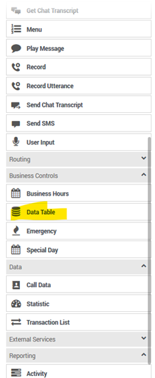
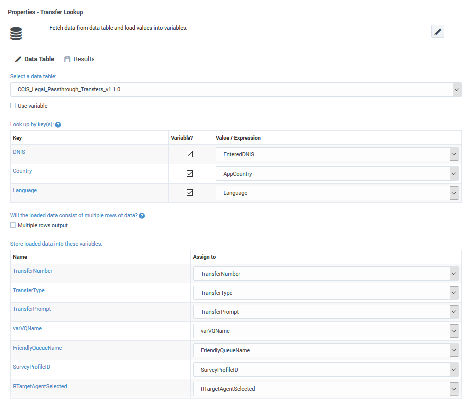
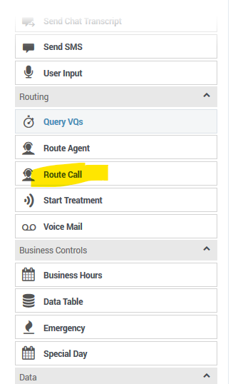
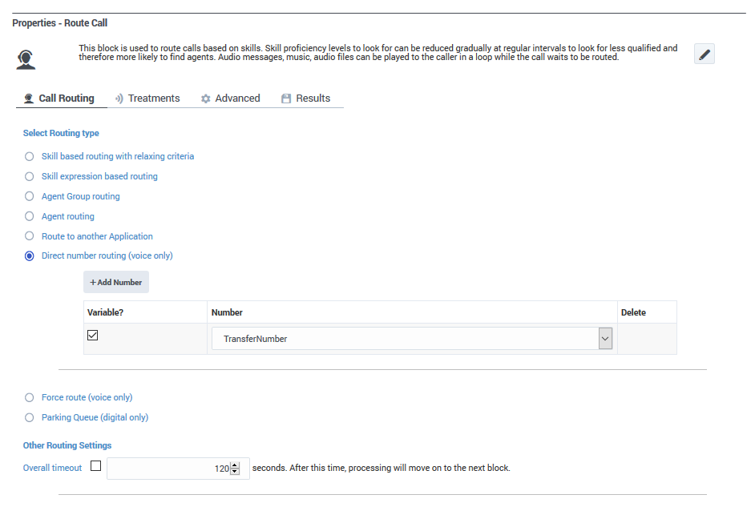

# Setting up call transfer for Genesys

The following instructions explain how to set up call redirection from a Genesys phone number to another phone

For the following to work, you need to build your application using the Designer. From within Designer, pull the following from the palette: 

Use DNIS, Country and Language as inputs and multiple fields for output, including TransferNumber:

Once the transfer number is set, add a Route Call from the palette:

Set up the Route Call as follows:

Depending on how their SBCs are set up, it might be necessary to include a plus in front of the transfer number. 
Also depending on how the application set up, the data table can be either in the 
Self Service section or Assisted Service and the Route Call has to be in Assisted Service. 
